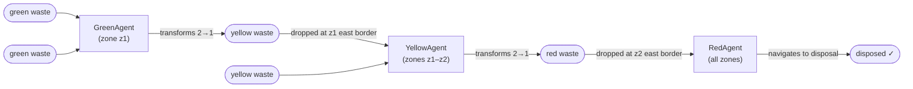
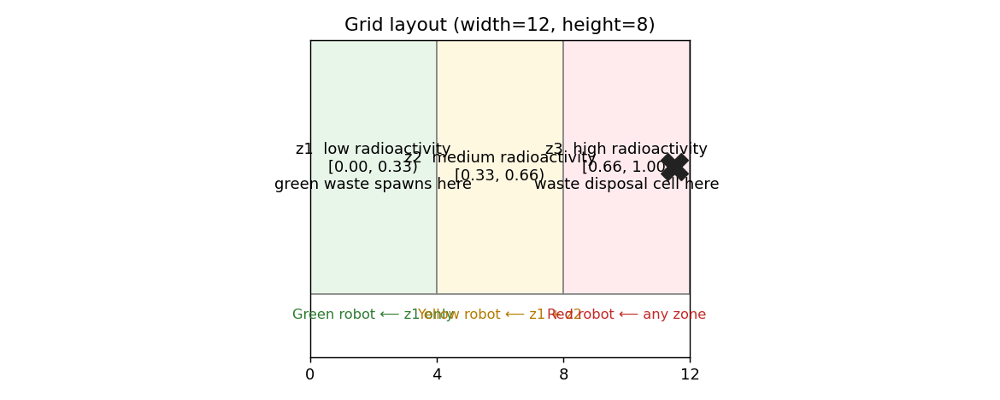
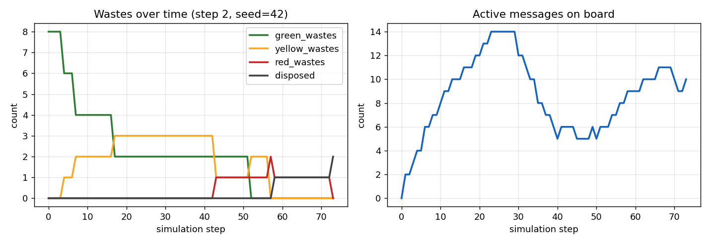
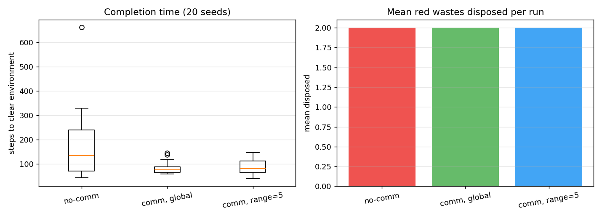

# Self-organization of robots in a hostile environment

**MAS 2025–2026 · Yoan Di Cosmo**

Multi-agent simulation of autonomous robots collecting, transforming and
disposing of radioactive waste across three zones of increasing radioactivity.
The global cleanup emerges from local perception, deliberation and (optional)
direct messaging — no central controller.

Built with [Mesa 3.x](https://mesa.readthedocs.io/) for agent-based modelling
and [Solara](https://solara.dev/) for the interactive visualization.

---

## Table of contents

1. [Quick start](#1-quick-start)
2. [File structure](#2-file-structure)
3. [Mission summary](#3-mission-summary)
4. [Environment](#4-environment)
5. [Agent architecture](#5-agent-architecture)
6. [Deliberation](#6-deliberation)
7. [Communication protocol (Step 2)](#7-communication-protocol-step-2)
8. [Metrics](#8-metrics)
9. [Results](#9-results)
10. [Environment properties](#10-environment-properties)
11. [Progress](#11-progress)
12. [Design choices](#12-design-choices)
13. [Known limitations](#13-known-limitations)

---

## 1. Quick start

```bash
pip install -r requirements.txt

python run.py                       # single run + chart
python run.py --no-communication    # step 1 only
python batch_run.py --n-seeds 20    # step 1 vs step 2 boxplot
python generate_figures.py          # regenerate README images
solara run server.py                # interactive browser viz
```

## 2. File structure

```
yoandicosmo_robot_mission_MAS2026/
├── objects.py            # Waste, Radioactivity, WasteDisposalZone  (passive)
├── agents.py             # GreenAgent, YellowAgent, RedAgent        (cognitive)
├── model.py              # RobotMission, do(action), message board
├── server.py             # Solara web visualization
├── run.py                # Single headless run + matplotlib chart
├── batch_run.py          # Multi-seed Step 1 vs Step 2 comparison
├── generate_figures.py   # Regenerate the plots embedded in this README
├── requirements.txt
├── README.md
└── images/
    ├── grid_layout.png
    ├── waste_dynamics.png
    └── step1_vs_step2.png
```

## 3. Mission summary

| Robot  | Collects       | Transforms      | Zone access  |
|--------|----------------|-----------------|--------------|
| Green  | 2 × green      | 2G → 1Y         | z1 only      |
| Yellow | 2 × yellow     | 2Y → 1R         | z1 + z2      |
| Red    | 1 × red        | (no transform)  | z1 + z2 + z3 |

Waste transformation pipeline:



Every 2-to-1 transformation imposes a mass-conservation rule: `N` initial
green wastes ⇒ at most `N/4` disposals. The implementation is verified to
conserve this invariant across runs.

### What makes this a MAS?

- **Multiple autonomous agents** — three robot roles operate independently with
  their own state and decision logic.
- **Shared environment** — a 2D grid divided into radioactivity zones is the
  common medium for indirect interaction (stigmergy).
- **Distributed problem solving** — each specialised role solves a sub-problem;
  the global cleanup emerges from local rules. No agent has a global view.
- **Optional direct communication** — a shared message board layer (Step 2)
  reinforces indirect coordination without replacing it.

## 4. Environment



- `MultiGrid` (non-torus) of configurable size (default 12×8).
- Width split into three equal vertical bands.
- Each cell carries a `Radioactivity(zone, level)` marker so robots can infer
  their zone without accessing model internals.

| Zone | x range (width=12) | Radioactivity | Role                          |
|------|--------------------|---------------|-------------------------------|
| z1   | 0 – 3              | 0.00 – 0.33   | Green waste spawns here       |
| z2   | 4 – 7              | 0.33 – 0.66   | Yellow transforms happen here |
| z3   | 8 – 11             | 0.66 – 1.00   | Disposal cell on east edge    |

The disposal cell is placed on a random y on column `width-1`. Because it is
the robots' mission target, its position is injected into every robot's
`knowledge["disposal_pos"]` at construction (the robots still have to
physically reach it).

## 5. Agent architecture

All three robot types inherit from `RobotAgent` and implement the canonical
PRS loop required by the assignment:

```python
def step(self):
    percepts = self.model.percepts_of(self)
    self._update_knowledge(percepts)
    action = self.deliberate(self.knowledge)     # pure function
    self.model.do(self, action)                  # environment enforces feasibility
```

**Encapsulation rule** — `deliberate(knowledge)` reads **only** its argument.
It never touches `self`, `self.model` or any global. The model's `do()`
method is the single authority on whether an action is feasible; agent
intentions and environment permissions are strictly separated.

Agents are **cognitive**, not reactive:

| Property        | Implementation                                             |
|-----------------|------------------------------------------------------------|
| Internal state  | `self.knowledge` dict (beliefs)                            |
| Memory          | `known_wastes`, `visited`, `idle_with_singleton`, `skip_pickup_until` |
| Planning        | Hard-wired priority cascade in `deliberate()`              |
| Learning        | None                                                       |
| Architecture    | PRS (Procedural Reasoning System) loop                     |

The knowledge base contains:

| Key                    | Meaning                                                  |
|------------------------|----------------------------------------------------------|
| `pos`                  | Current cell                                             |
| `inventory_colors`     | Colors of carried wastes (for `deliberate`)              |
| `zone_max`             | Maximum zone this robot is allowed to enter              |
| `collect_color`        | Color this robot picks up for transformation             |
| `produce_color`        | Color produced after transforming (None for Red)         |
| `capacity`             | How many `collect_color` units before transforming       |
| `known_wastes`         | `{pos: color}` ever seen, decayed on direct observation |
| `disposal_pos`         | Position of the disposal cell                            |
| `visited`              | Set of cells already visited (for exploration)           |
| `messages`             | Messages received this step (Step 2 only)                |
| `idle_with_singleton`  | Steps spent stuck with 1 unpaired waste                  |
| `skip_pickup_until`    | Anti-repickup cooldown after a deadlock drop             |

**Perception** uses the **Moore 8-neighbourhood** (the current cell plus all
eight neighbours including diagonals).

### Action set

| Action      | Preconditions                                                   | Effect                                                 |
|-------------|-----------------------------------------------------------------|--------------------------------------------------------|
| `MOVE`      | Destination within grid and within the agent's allowed zone     | Agent relocates on the grid                            |
| `PICKUP`    | Matching waste on current cell, capacity not exceeded, not in cooldown | Waste leaves the grid, joins agent inventory; `waste_gone` broadcast |
| `TRANSFORM` | `CAPACITY` units of `collect_color` in inventory                | Those wastes are destroyed; one `produce_color` appears in inventory |
| `DROP`      | Agent carries a waste of the requested color                    | If on disposal cell with a red → waste is put away and counted. Otherwise waste re-appears on grid; `waste_at` or `disposed` broadcast |
| `WAIT`      | (none)                                                          | No-op                                                  |

Feasibility is checked by `model.do()`; an agent proposing an illegal action
receives a fresh percept dict unchanged and retries next step. Agents never
mutate the grid directly.

## 6. Deliberation

Each agent type follows a priority cascade. The first matching rule fires.

### Green / Yellow (`_deliberate_collector`)

```
P1.  carry CAPACITY × collect_color  →  TRANSFORM
P2.  carry produce_color             →  MOVE east, DROP at zone frontier
P3.  collect_color on this cell      →  PICKUP  (unless in cooldown here)
P4.  know a collect_color somewhere  →  MOVE toward it
P4b. singleton stuck ≥ 15 steps      →  DROP (break pairing deadlock)
P5.  otherwise                       →  MOVE random legal, prefer unvisited
```

### Red (`_deliberate_red`)

```
P1. carry red                        →  MOVE toward disposal_pos, DROP when there
P2. red on this cell                 →  PICKUP
P3. know a red somewhere             →  MOVE toward it
P4. otherwise                        →  if west of z3, MOVE east; else explore
```

### Deadlock breaking (P4b)

With 3 green robots and 8 green wastes it is easy to end up with one robot
holding 1 green and no other green in sight (8 / 2 = 4 transforms possible,
but if two robots each hold 1 green, neither can transform). A robot that
has been carrying a singleton for 15 steps **drops it back on its cell** and
enters an 8-step pickup cooldown at that location, letting a peer come and
grab it for consolidation. In Step 2 this drop is also broadcast.

## 7. Communication protocol (Step 2)

Disabled → pure stigmergy (coordination by waste objects on the grid).
Enabled → a shared **message board** on the model, broadcast at every `DROP`
and every disposal.

### Message board

| Field       | Description                                  |
|-------------|----------------------------------------------|
| `type`      | `"waste_at"`, `"waste_gone"`, `"disposed"`   |
| `pos`       | Cell concerned                               |
| `color`     | `green` / `yellow` / `red`                   |
| `sender_id` | Robot that emitted it (never re-delivered)   |
| `ttl`       | Steps remaining before automatic deletion    |

### Message types

| Type          | Sent when                        | Effect on receiver                        |
|---------------|----------------------------------|-------------------------------------------|
| `waste_at`    | A robot drops a waste on the grid | `known_wastes[pos] = color`              |
| `waste_gone`  | A robot picks up a waste         | `known_wastes.pop(pos)`                   |
| `disposed`    | A red is put in the disposal cell | `known_wastes.pop(pos)`                  |

### Delivery

- `comm_range = 0` → **global** broadcast (everyone receives).
- `comm_range > 0` → Manhattan cutoff between sender pos and receiver pos.
- Default `message_ttl = 30` steps. Messages consumed each step are **not**
  accumulated: a stale `waste_at` does not mislead an agent forever.

### Sequence example

```
GreenAgent          YellowAgent
     │                   │
     │ carry 2 green → TRANSFORM
     │ carry 1 yellow → MOVE east
     │ at z1 frontier → DROP yellow
     │
     ├── broadcast ─{waste_at, (3,4), yellow}─►│
     │                                         │ known_wastes[(3,4)] = yellow
     │                                         │ deliberate → MOVE toward (3,4)
     │                                         │ PICKUP yellow
     │                                         │
     │◄── broadcast ─{waste_gone, (3,4)}───────┤
     │ known_wastes.pop((3,4))                 │
```

## 8. Metrics

Collected by `model.datacollector` at every step:

| Metric            | Description                                        |
|-------------------|----------------------------------------------------|
| `green_wastes`    | Green wastes in env (grid + carried by robots)     |
| `yellow_wastes`   | Yellow wastes in env                               |
| `red_wastes`      | Red wastes in env                                  |
| `disposed`        | Cumulative red wastes delivered to disposal       |
| `messages_active` | Size of the message board                          |

## 9. Results

### 9.1 Waste dynamics (single seed)



One run of the default scenario (12×8, 3G/2Y/2R, 8 initial greens, seed=42,
communication on). Reads left to right as:

- Green wastes drop from 8 → 0 over steps 0–14 (green robots collect them).
- Yellow wastes peak at 4 around step 17 (`8 greens ÷ 2 = 4` transforms) then
  decay as yellow robots transform 2Y → 1R.
- A visible plateau at `yellow = 2` from step 20 to ~55 is the pairing
  deadlock being resolved by the P4b drop-after-15-idle rule.
- Disposals reach 2 at step 73 → run completes (the pipeline converts
  `8 → 4 → 2 → 2` with exact mass conservation).
- Messages peak at 17 around the transformation burst, decay with TTL=30.

### 9.2 Step 1 vs Step 2 (20 seeds)



Each configuration run over 20 different seeds, same scenario otherwise:

| Config            | Mean steps | Std  | Min | Max | Mean disposed |
|-------------------|-----------:|-----:|----:|----:|--------------:|
| no-comm (Step 1)  |      172.2 | 142.6|  43 | 661 |           2.0 |
| comm, global      |       83.0 |  24.5|  58 | 144 |           2.0 |
| comm, range=5     |       85.8 |  29.5|  39 | 146 |           2.0 |

Key observations:

- **~2× faster** mean completion with communication.
- **~6× lower standard deviation** — communication converts a long right-tail
  distribution into a tight one. Some `no-comm` seeds take 661 steps to
  finish, none of the `comm` seeds exceed 146.
- All three configs reach 100 % completion (all 2 reds disposed every time),
  so the difference is purely about speed and variance, not correctness.
- Global range and range=5 are statistically indistinguishable on a 12-wide
  grid (range ≥ half-width is effectively global).

## 10. Environment properties

| Property        | Value                 | Justification                                           |
|-----------------|-----------------------|---------------------------------------------------------|
| Observability   | Partially observable  | Moore 8-neighbourhood only                              |
| Determinism     | Stochastic            | Random walk fallback; shuffled activation per step      |
| Dynamics        | Dynamic               | Peer robots mutate cells between activations            |
| Time            | Discrete              | Integer step counter, finite action set                 |
| Coupling        | Loosely coupled       | No robot reads another robot's internal state           |
| Openness        | Closed                | Population fixed at construction                        |

## 11. Progress

| Step                                     | Status      | Notes                                        |
|------------------------------------------|-------------|----------------------------------------------|
| Step 1 · Agents without communication    | Done        | All three robot types, transform pipeline, data collector, Solara viz |
| Step 2 · Agents with communication       | Done        | Shared message board with TTL and range; `waste_at` / `waste_gone` / `disposed` |
| Step 3 · Agents with communication and uncertainty | TBA | Spec pending                             |

## 12. Design choices

| Choice                                            | Why                                                                             |
|---------------------------------------------------|--------------------------------------------------------------------------------|
| Cognitive agents, not reactive                    | Reactive agents would drop and re-pick the same waste each step                |
| `deliberate(knowledge)` strictly encapsulated     | Required by the assignment; enforces agent/environment separation              |
| Zone enforcement in `model.do()`, not in agents   | Environment is the sole authority on feasibility                               |
| Single disposal cell                              | Creates genuine coordination pressure for red robots                           |
| Moore 8-neighbourhood                             | Lets diagonal cells be observed, reduces reliance on comms                     |
| Deadlock-break drop after 15 idle steps           | Prevents structural pairing deadlocks in Step 1                                |
| 8-step pickup cooldown after drop                 | Stops immediate re-pick of the same waste                                      |
| Disposal position given a priori to all robots    | Robots are designed for this mission; they still have to physically navigate   |
| Message TTL = 30 steps                            | Long enough to coordinate a handoff, short enough to drop stale info           |
| Messages **not** accumulated across steps         | Stale messages would mislead P4 and starve P4b                                 |

## 13. Known limitations

- Navigation is greedy Manhattan toward the target — no path planning, so a
  robot can be momentarily blocked by grid-edge geometry.
- No collision / cell-contention handling; multiple robots may crowd a cell.
- No learning or strategy adaptation across runs.
- `comm_range` effect is weak on a 12-wide grid because radius-5 already
  nearly covers it. A 30-wide grid (cf. colinfrisch/SMA) would show a
  clearer range-dependent curve.
