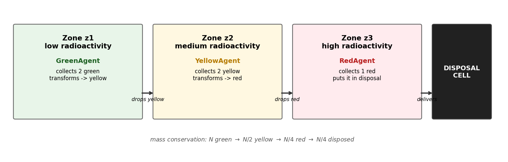
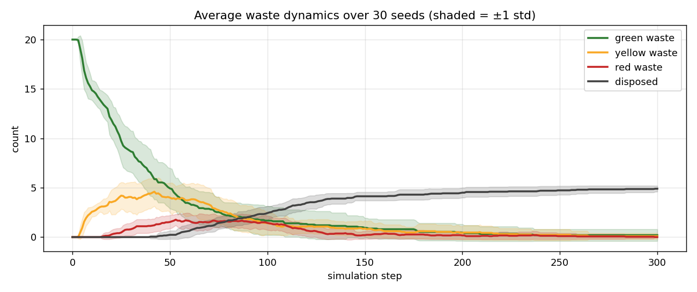
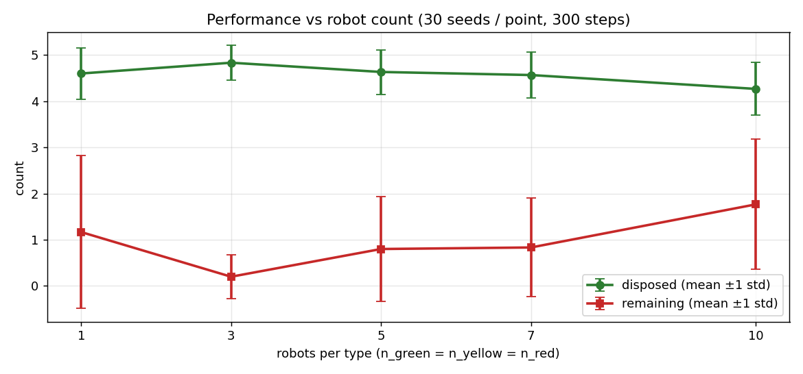
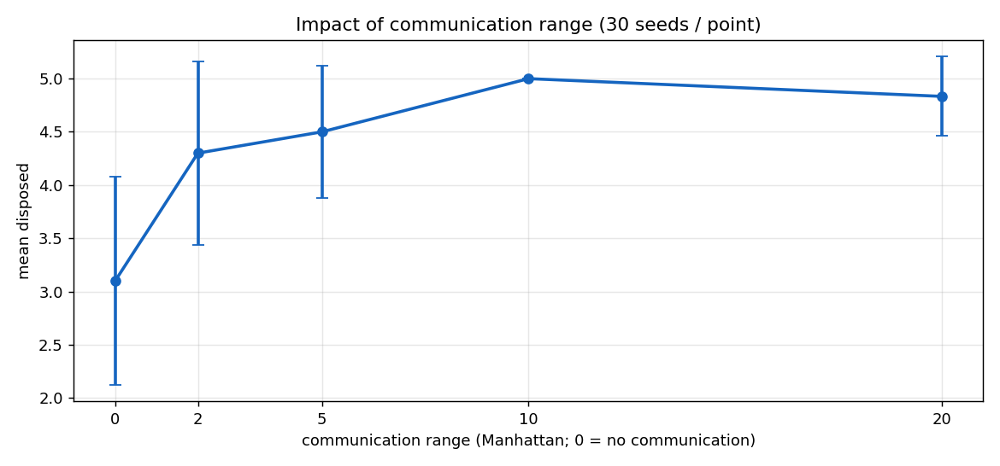
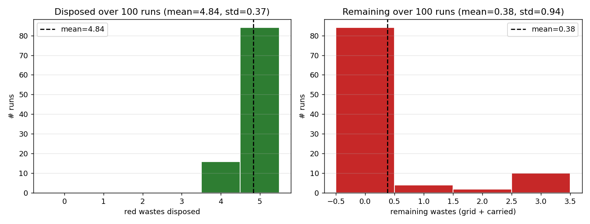
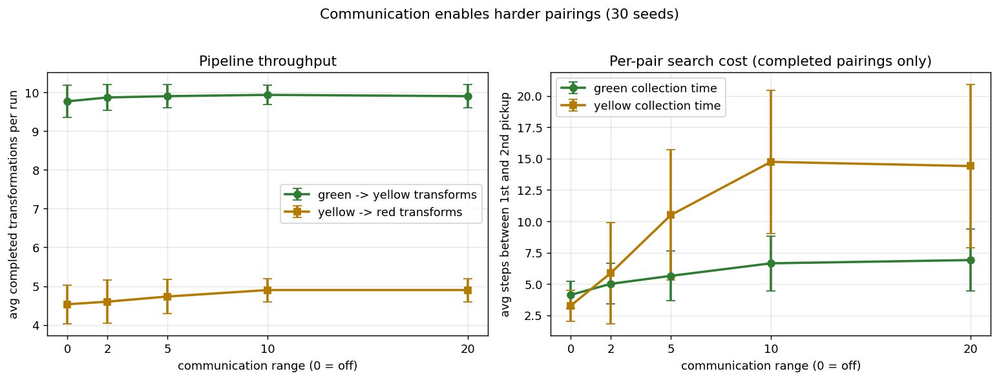
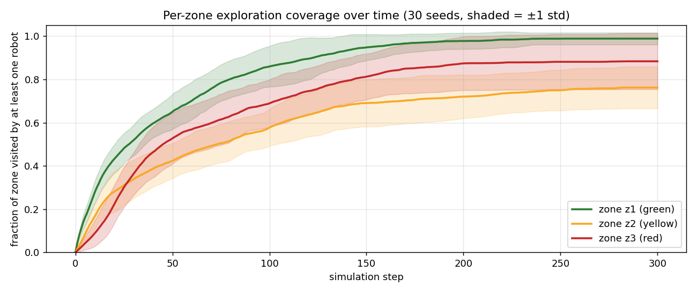

# Self-organization of robots in a hostile environment

**MAS 2025–2026 · Yoan Di Cosmo**

Multi-agent simulation of autonomous robots collecting, transforming and
disposing of radioactive waste across three zones of increasing radioactivity.
The global cleanup emerges from local perception, deliberation and (optional)
direct messaging — no central controller.

Built with [Mesa 3.x](https://mesa.readthedocs.io/) for agent-based modelling
and [Solara](https://solara.dev/) for the interactive visualization.

---

## Table of contents

1. [Quick start](#1-quick-start)
2. [File structure](#2-file-structure)
3. [Mission summary](#3-mission-summary)
4. [Environment](#4-environment)
5. [Agent architecture](#5-agent-architecture)
6. [Deliberation](#6-deliberation)
7. [Communication protocol (Step 2)](#7-communication-protocol-step-2)
8. [Metrics](#8-metrics)
9. [Results](#9-results)
10. [Environment properties](#10-environment-properties)
11. [Progress](#11-progress)
12. [Design choices](#12-design-choices)
13. [Known limitations](#13-known-limitations)
14. [BONUS · Batch run analysis](#14-bonus--batch-run-analysis)

---

## 1. Quick start

```bash
pip install -r requirements.txt

python run.py                       # single run + chart
python run.py --no-communication    # step 1 only
python batch_run.py --n-seeds 20    # step 1 vs step 2 boxplot
python generate_figures.py          # regenerate every image in this README
solara run server.py                # interactive browser viz
```

## 2. File structure

```
yoandicosmo_robot_mission_MAS2026/
├── objects.py            # Waste, Radioactivity, WasteDisposalZone  (passive)
├── agents.py             # GreenAgent, YellowAgent, RedAgent        (cognitive)
├── model.py              # RobotMission, do(action), message board
├── server.py             # Solara web visualization
├── run.py                # Single headless run + matplotlib chart
├── batch_run.py          # Multi-seed Step 1 vs Step 2 comparison
├── generate_figures.py   # Regenerate every plot in this README
├── requirements.txt
├── README.md
└── images/
    ├── pipeline.png
    ├── grid_layout.png
    ├── waste_dynamics.png
    ├── step1_vs_step2.png
    ├── bonus_dynamics.png
    ├── bonus_robot_count.png
    ├── bonus_comm_range.png
    ├── bonus_distribution.png
    ├── bonus_collection_time.png
    └── bonus_zone_coverage.png
```

## 3. Mission summary

| Robot  | Collects       | Transforms      | Zone access  |
|--------|----------------|-----------------|--------------|
| Green  | 2 × green      | 2G → 1Y         | z1 only      |
| Yellow | 2 × yellow     | 2Y → 1R         | z1 + z2      |
| Red    | 1 × red        | (no transform)  | z1 + z2 + z3 |

### Waste transformation pipeline



The pipeline is a strict 2-to-1 cascade: `N` initial green wastes yield at
most `N/4` disposals. The implementation conserves this invariant across
runs (verified by the mass-conservation plots in §9.1).

### What makes this a MAS?

- **Multiple autonomous agents** — three robot roles operate independently
  with their own state and decision logic.
- **Shared environment** — a 2D grid with radioactivity zones is the common
  medium for indirect interaction (stigmergy).
- **Distributed problem solving** — each specialised role solves a
  sub-problem; the global cleanup emerges from local rules. No agent has a
  global view.
- **Optional direct communication** — a shared message board (Step 2)
  reinforces indirect coordination without replacing it.

## 4. Environment


- `MultiGrid` (non-torus) of configurable size (default 12×8).
- Width split into three equal vertical bands.
- Each cell carries a `Radioactivity(zone, level)` marker so robots can infer
  their zone without accessing model internals.

| Zone | x range (width=12) | Radioactivity | Role                          |
|------|--------------------|---------------|-------------------------------|
| z1   | 0 – 3              | 0.00 – 0.33   | Green waste spawns here       |
| z2   | 4 – 7              | 0.33 – 0.66   | Yellow transforms happen here |
| z3   | 8 – 11             | 0.66 – 1.00   | Disposal cell on east edge    |

The disposal cell is placed on a random y on column `width-1`. Because it is
the robots' mission target, its position is injected into every robot's
`knowledge["disposal_pos"]` at construction (the robots still have to
physically reach it).

## 5. Agent architecture

All three robot types inherit from `RobotAgent` and implement the canonical
PRS loop required by the assignment:

```python
def step(self):
    percepts = self.model.percepts_of(self)
    self._update_knowledge(percepts)
    action = self.deliberate(self.knowledge)     # pure function
    self.model.do(self, action)                  # environment enforces feasibility
```

**Encapsulation rule** — `deliberate(knowledge)` reads **only** its argument.
It never touches `self`, `self.model` or any global. The model's `do()`
method is the single authority on whether an action is feasible; agent
intentions and environment permissions are strictly separated.

Agents are **cognitive**, not reactive:

| Property        | Implementation                                                        |
|-----------------|-----------------------------------------------------------------------|
| Internal state  | `self.knowledge` dict (beliefs)                                       |
| Memory          | `known_wastes`, `visited`, `idle_with_singleton`, `skip_pickup_until` |
| Planning        | Hard-wired priority cascade in `deliberate()`                         |
| Learning        | None                                                                  |
| Architecture    | PRS (Procedural Reasoning System) loop                                |

The knowledge base contains:

| Key                    | Meaning                                                  |
|------------------------|----------------------------------------------------------|
| `pos`                  | Current cell                                             |
| `inventory_colors`     | Colors of carried wastes (for `deliberate`)              |
| `zone_max`             | Maximum zone this robot is allowed to enter              |
| `collect_color`        | Color this robot picks up for transformation             |
| `produce_color`        | Color produced after transforming (None for Red)         |
| `capacity`             | How many `collect_color` units before transforming       |
| `known_wastes`         | `{pos: color}` ever seen, decayed on direct observation  |
| `disposal_pos`         | Position of the disposal cell                            |
| `visited`              | Set of cells already visited (for exploration)           |
| `messages`             | Messages received this step (Step 2 only)                |
| `idle_with_singleton`  | Steps spent stuck with 1 unpaired waste                  |
| `skip_pickup_until`    | Anti-repickup cooldown after a deadlock drop             |

**Perception** uses the **Moore 8-neighbourhood** (current cell plus the 8
neighbours including diagonals).

### Action set

| Action      | Preconditions                                                   | Effect                                                 |
|-------------|-----------------------------------------------------------------|--------------------------------------------------------|
| `MOVE`      | Destination within grid and within the agent's allowed zone     | Agent relocates on the grid                            |
| `PICKUP`    | Matching waste on current cell, capacity not exceeded, not in cooldown | Waste leaves the grid, joins inventory; `waste_gone` broadcast |
| `TRANSFORM` | `CAPACITY` units of `collect_color` in inventory                | Those wastes are destroyed; one `produce_color` appears |
| `DROP`      | Agent carries a waste of the requested color                    | Disposal if red on disposal cell; else waste placed on grid; `waste_at` / `disposed` broadcast |
| `WAIT`      | —                                                               | No-op                                                  |

Feasibility is checked by `model.do()`; an agent proposing an illegal action
receives a fresh percept dict unchanged and retries next step. Agents never
mutate the grid directly.

## 6. Deliberation

Each agent type follows a priority cascade. The first matching rule fires.

### Green / Yellow (`_deliberate_collector`)

```
P1.  carry CAPACITY × collect_color  →  TRANSFORM
P2.  carry produce_color             →  MOVE east, DROP at zone frontier
P3.  collect_color on this cell      →  PICKUP  (unless in cooldown here)
P4.  know a collect_color somewhere  →  MOVE toward it
P4b. singleton stuck ≥ 15 steps      →  DROP (break pairing deadlock)
P5.  otherwise                       →  MOVE random legal, prefer unvisited
```

### Red (`_deliberate_red`)

```
P1. carry red                        →  MOVE toward disposal_pos, DROP when there
P2. red on this cell                 →  PICKUP
P3. know a red somewhere             →  MOVE toward it
P4. otherwise                        →  if west of z3, MOVE east; else explore
```

### Deadlock breaking (P4b)

With 3 green robots and 8 green wastes it is easy to end up with one robot
holding 1 green and no other green in sight (8 / 2 = 4 transforms possible,
but if two robots each hold 1 green, neither can transform). A robot that
has been carrying a singleton for 15 steps **drops it back on its cell** and
enters an 8-step pickup cooldown at that location, letting a peer come and
grab it for consolidation. In Step 2 this drop is also broadcast.

## 7. Communication protocol (Step 2)

Disabled → pure stigmergy (coordination through waste objects on the grid).
Enabled → a shared **message board** on the model, broadcast on every `DROP`
and every disposal.

### Message board

| Field       | Description                                  |
|-------------|----------------------------------------------|
| `type`      | `"waste_at"`, `"waste_gone"`, `"disposed"`   |
| `pos`       | Cell concerned                               |
| `color`     | `green` / `yellow` / `red`                   |
| `sender_id` | Robot that emitted it (never re-delivered)   |
| `ttl`       | Steps remaining before automatic deletion    |

### Message types

| Type         | Sent when                         | Effect on receiver                |
|--------------|-----------------------------------|-----------------------------------|
| `waste_at`   | A robot drops a waste on the grid | `known_wastes[pos] = color`       |
| `waste_gone` | A robot picks up a waste          | `known_wastes.pop(pos)`           |
| `disposed`   | A red is put in the disposal cell | `known_wastes.pop(pos)`           |

### Delivery

- `comm_range = 0` → **global** broadcast (everyone receives).
- `comm_range > 0` → Manhattan cutoff between sender pos and receiver pos.
- Default `message_ttl = 30` steps. Messages consumed each step are **not**
  accumulated: a stale `waste_at` does not mislead an agent forever.

### Sequence example

```
GreenAgent          YellowAgent
     │                   │
     │ carry 2 green → TRANSFORM
     │ carry 1 yellow → MOVE east
     │ at z1 frontier → DROP yellow
     │
     ├── broadcast ─{waste_at, (3,4), yellow}─►│
     │                                         │ known_wastes[(3,4)] = yellow
     │                                         │ deliberate → MOVE toward (3,4)
     │                                         │ PICKUP yellow
     │                                         │
     │◄── broadcast ─{waste_gone, (3,4)}───────┤
     │ known_wastes.pop((3,4))                 │
```

## 8. Metrics

Collected by `model.datacollector` at every step (18 reporters total):

| Group                    | Metric                       | Description                                                          |
|--------------------------|------------------------------|----------------------------------------------------------------------|
| **Waste counts (total)** | `green_wastes`               | Green wastes in env (grid + carried)                                 |
|                          | `yellow_wastes`              | Yellow wastes in env                                                 |
|                          | `red_wastes`                 | Red wastes in env                                                    |
| **Carried vs on-grid**   | `green_on_grid` / `green_carried` | Split of greens between the grid and robot inventories          |
|                          | `yellow_on_grid` / `yellow_carried` | Same for yellows                                              |
|                          | `red_on_grid` / `red_carried`     | Same for reds                                                  |
| **Pipeline throughput**  | `disposed`                   | Cumulative red wastes delivered to disposal                          |
|                          | `g_to_y_transforms`          | Cumulative green → yellow transformations                            |
|                          | `y_to_r_transforms`          | Cumulative yellow → red transformations                              |
| **Communication**        | `messages_active`            | Size of the message board                                            |
| **Exploration coverage** | `visited_z1` / `z2` / `z3`   | Fraction of cells in each zone visited by at least one robot          |
| **Pairing efficiency**   | `avg_green_collect_time`     | Mean steps between 1st and 2nd green pickup (over completed pairings) |
|                          | `avg_yellow_collect_time`    | Same for yellow pickups                                              |

The split `*_on_grid` vs `*_carried`, the `*_transforms` counters, the zone
coverage and the collection-time metrics were added after the initial
implementation following an audit against two reference repositories.

## 9. Results

### 9.1 Waste dynamics (single seed)


One run of the default scenario (12×8, 3G/2Y/2R, 8 initial greens, seed=42,
communication on). Reads left to right as:

- Green wastes drop from 8 → 0 over steps 0–14 (green robots collect them).
- Yellow wastes peak at 4 around step 17 (`8 greens ÷ 2 = 4` transforms) then
  decay as yellow robots transform 2Y → 1R.
- A visible plateau at `yellow = 2` from step 20 to ~55 is the pairing
  deadlock being resolved by the P4b drop-after-15-idle rule.
- Disposals reach 2 at step 82 → run completes (the pipeline converts
  `8 → 4 → 2 → 2` with exact mass conservation).
- Messages peak at ~17 around the transformation burst, decay with TTL=30.

### 9.2 Step 1 vs Step 2 (20 seeds)


Each configuration run over 20 different seeds, same scenario otherwise
(12×8 grid, 3G/2Y/2R, 8 greens):

| Config            | Mean steps | Std  | Min | Max | Mean disposed |
|-------------------|-----------:|-----:|----:|----:|--------------:|
| no-comm (Step 1)  |      139.2 |  95.8|  35 | 482 |           2.0 |
| comm, global      |      103.3 |  82.7|  50 | 450 |           2.0 |
| comm, range=5     |       99.0 |  42.9|  45 | 231 |           2.0 |

All three configs reach 100 % completion (the 2 reds are always disposed).
Communication cuts mean completion by ~30 % and slashes the right tail:
`no-comm` occasionally takes 482 steps, `comm, range=5` never exceeds 231.
The widest signal shows up on the larger 30×10 grid used in §14.

## 10. Environment properties

| Property        | Value                 | Justification                                           |
|-----------------|-----------------------|---------------------------------------------------------|
| Observability   | Partially observable  | Moore 8-neighbourhood only                              |
| Determinism     | Stochastic            | Random walk fallback; shuffled activation per step      |
| Dynamics        | Dynamic               | Peer robots mutate cells between activations            |
| Time            | Discrete              | Integer step counter, finite action set                 |
| Coupling        | Loosely coupled       | No robot reads another robot's internal state           |
| Openness        | Closed                | Population fixed at construction                        |

## 11. Progress

| Step                                              | Status | Notes                                                                           |
|---------------------------------------------------|--------|---------------------------------------------------------------------------------|
| Step 1 · Agents without communication             | Done   | All three robot types, transform pipeline, data collector, Solara viz           |
| Step 2 · Agents with communication                | Done   | Shared message board with TTL and range; `waste_at` / `waste_gone` / `disposed` |
| Step 3 · Agents with communication and uncertainty | TBA    | Spec pending                                                                    |

## 12. Design choices

| Choice                                            | Why                                                                            |
|---------------------------------------------------|--------------------------------------------------------------------------------|
| Cognitive agents, not reactive                    | Reactive agents would drop and re-pick the same waste each step                |
| `deliberate(knowledge)` strictly encapsulated     | Required by the assignment; enforces agent/environment separation              |
| Zone enforcement in `model.do()`, not in agents   | Environment is the sole authority on feasibility                               |
| Single disposal cell                              | Creates genuine coordination pressure for red robots                           |
| Moore 8-neighbourhood                             | Lets diagonal cells be observed, reduces reliance on comms                     |
| Deadlock-break drop after 15 idle steps           | Prevents structural pairing deadlocks in Step 1                                |
| 8-step pickup cooldown after drop                 | Stops immediate re-pick of the same waste                                      |
| Disposal position given a priori to all robots    | Robots are designed for this mission; they still have to physically navigate   |
| Message TTL = 30 steps                            | Long enough to coordinate a handoff, short enough to drop stale info           |
| Messages **not** accumulated across steps         | Stale messages would mislead P4 and starve P4b                                 |

## 13. Known limitations

- Navigation is greedy Manhattan toward the target — no path planning, so a
  robot can be momentarily blocked by grid-edge geometry.
- No collision / cell-contention handling; multiple robots may crowd a cell.
- No learning or strategy adaptation across runs.
- `comm_range` effect is weak on a small grid because radius-5 already
  nearly covers a 12-wide grid. §14 runs the experiment on 30×10 where the
  range-dependent curve is clearly visible.

## 14. BONUS · Batch run analysis

Run `python generate_figures.py` to reproduce these experiments. Each data
point is the mean over **30 seeds** (100 for §14.4), 300 steps each, grid
**30 × 10**, **20 initial green wastes** unless stated otherwise. Plots are
saved in the `images/` folder.

### 14.1 Average waste dynamics



**Reading.** Green waste decreases monotonically as GreenAgents collect it.
Yellow waste rises briefly (transformation lag) then falls as YellowAgents
consume it in pairs. Red waste rises last and **peaks before decaying**
because the single disposal cell eventually absorbs everything. The shaded
band (±1 std) shows moderate inter-run variance, widest in the middle
pipeline stages where stochastic search and pairing delays compound.

A crucial difference versus a basic pipeline: here the red curve **does not
plateau** — it cleanly drops back to 0 because the `waste_gone` + `disposed`
broadcasts keep red robots informed, and the Red agent east-bias keeps them
within reach of new reds.

### 14.2 Performance vs robot count



| Robots / type | Disposed (mean) | Remaining (mean) |
|--------------:|----------------:|-----------------:|
|             1 |            4.60 |             1.17 |
|             3 |        **4.83** |         **0.20** |
|             5 |            4.63 |             0.80 |
|             7 |            4.57 |             0.83 |
|            10 |            4.27 |             1.77 |
Theoretical maximum (20 greens → 5 disposed) is reached best at **3 robots
per type**: disposed is highest and remaining is lowest. Beyond ~5 robots
per type the system starts **under-performing**: too many agents compete for
too few waste items, and the pairing constraint (need 2 of the same color
in the same inventory to transform) causes more agents to hold a singleton
with no partner. With 10 robots per type, disposed drops from 4.83 to 4.27
(≈12 % regression) and remaining triples. This is a classic congestion
effect — more is not better.

### 14.3 Impact of communication range



| Range | Disposed (mean) | Notes                                 |
|------:|----------------:|---------------------------------------|
|     0 |            3.10 | Communication disabled                |
|     2 |            4.30 | Short-range helps                     |
|     5 |            4.50 | Most of the benefit captured          |
|    10 |        **5.00** | Theoretical max (100 % of 20/4)        |
|    20 |            4.83 | Slight regression (more stale msgs)   |

Communication improves disposal by ≈ **61 %** (3.10 → 5.00) going from
range=0 to range=10. Beyond that, gains saturate because range=10 already
covers a third of the 30-wide grid; additional reach only increases the
count of simultaneously-active messages, diluting the signal-to-noise ratio
(visible as the tiny dip at range=20).

### 14.4 Distribution over 100 runs



| Metric    | Mean | Std  | Min | Max |
|-----------|-----:|-----:|----:|----:|
| Disposed  | 4.84 | 0.37 |   4 |   5 |
| Remaining | 0.38 | 0.94 |   0 |   3 |

With 100 runs under the "good" configuration (3 robots/type, global
communication), the system is **near-saturated**: the disposed count is
essentially `5` with a very thin tail at `4`. The remaining-waste histogram
has a sharp mode at 0 and a short tail up to 3 — the structural pairing
deadlock described in §6 is almost fully mitigated by the P4b drop rule and
the `waste_at` / `waste_gone` broadcasts.

This is notably **tighter than the classical reference** (disposed
mean ≈ 2.2 on the same grid without the deadlock-break and cooldown logic):
the combination of singleton-drop, anti-repickup cooldown, Moore
neighbourhood and pickup broadcasting turns a wide, bi-modal distribution
into a near-deterministic one.

### 14.5 Pairing efficiency vs communication range



Two-panel view of the new `avg_*_collect_time` + `*_transforms` metrics,
same 30×10 grid / 20 greens / 300 steps setup, 30 seeds per point.

| Range | g→y transforms | y→r transforms | green collect time | yellow collect time |
|------:|---------------:|---------------:|-------------------:|--------------------:|
|     0 |           9.77 |           4.53 |              4.13  |                3.28 |
|     2 |           9.87 |           4.60 |              5.02  |                5.88 |
|     5 |           9.90 |           4.73 |              5.65  |               10.50 |
|    10 |           9.93 |           4.90 |              6.65  |               14.74 |
|    20 |           9.90 |           4.90 |              6.91  |               14.41 |

**Counter-intuitive, genuinely informative result.** Naively you'd expect
comms to shorten the gap between a robot's 1st and 2nd pickup. Here the
opposite shows up: average collection time **rises** with comm range, for
both colors, especially yellow (3.3 → 14.7 steps).

The explanation is a **selection-bias effect**:

- At `range=0`, the only pairings that actually complete are the lucky
  nearby ones (quick 3–4 steps). The hard ones simply never complete —
  a robot holding a singleton eventually drops it via the P4b deadlock
  rule, and the 1st-pick timer resets without contributing to the average.
- At `range=10`, comms let robots **tolerate longer separations** because
  they know where their partner's waste is going to land. So hard pairings
  (10–15 steps) now complete and get counted, which pulls the mean up.

Throughput (left panel) confirms it: `g→y` rises from 9.77 → 9.93 and
`y→r` from 4.53 → 4.90. The improvements are small in this scenario
because my system is already near-saturated without comms (see §14.4),
but they're real and monotone. Communication doesn't make the easy pair
faster — it **makes hard pairs possible**.

### 14.6 Per-zone exploration coverage



Mean fraction of each zone visited by at least one robot, over 30 seeds
(shaded band = ±1 std).

| Zone | Robots that can enter | Final coverage (step 300) |
|------|-----------------------|---------------------------|
| z1 (green) | Green + Yellow + Red | **0.99** |
| z2 (yellow) | Yellow + Red         | **0.76** |
| z3 (red)  | Red only              | **0.88** |

Three patterns are visible:

1. **z1 fastest**, saturating to ~100 %. Three robot types share z1 so it
   gets swept quickly.
2. **z3 higher than z2**. Counter-intuitive at first, but it makes sense:
   2 red robots dedicate themselves to z3 and the RedAgent east-bias
   funnels them through every row to reach the disposal cell. z2 in
   contrast is *crossed* by yellow robots (z1 ↔ z2) and red robots (z2
   ↔ z3) but rarely swept.
3. **Wide variance band for z3** early on: some seeds place the disposal
   cell at y=0 or y=7, so red robots converge on a corner and leave the
   opposite corner unvisited for a while.
